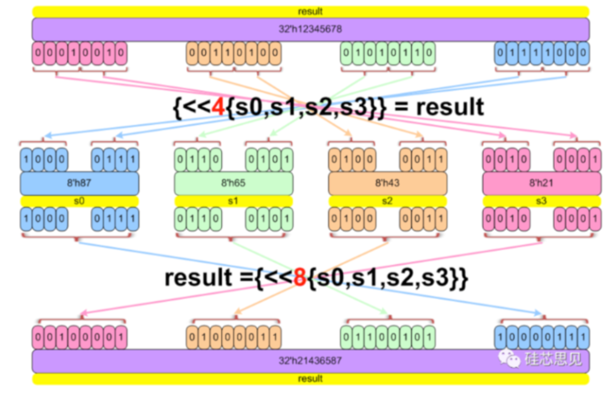

# 数组与流操作符：packed / unpacked / dynamic / queue / associative / streaming

## 1. packed 数组 vs unpacked 数组

### 原始笔记

```systemverilog
bit[3:0][7:0] data; data = 32'h0; //4row 8col
foreach (array[i][j])
//unpacked arrays
reg [15:0] mem3 [0:3][0:1];//4row 2col
logic [7:0] m [2][2] = '{ '{5, 10}, '{15, 20} };
$size(mem3, 1) = 4
```

### 讲解

判断一个多维数组是 **packed** 还是 **unpacked**，就看维度写在变量名**前面**还是**后面**：

```systemverilog
bit [3:0][7:0] data;     // packed：维度写在变量名前面
reg [15:0] mem3 [0:3][0:1];   // unpacked：[0:3][0:1] 写在变量名后面
```

- **packed 数组**（`bit[3:0][7:0] data;`）：4 个 8 位的"行"紧密排布成一个连续的 32 位位矢量，可以整体当成一个 32 位数来赋值：`data = 32'h0;`。笔记里"4row 8col"就是说这是一个 4 行、每行 8 位的 packed 数组。
- **unpacked 数组**（`reg [15:0] mem3 [0:3][0:1];`）：`[0:3][0:1]` 是两个 unpacked 维度（4 个 × 2 个），每个元素是 16 位的 `reg`，元素之间**不保证**在存储上连续排布，不能像 packed 数组那样直接当一个大位矢量整体赋值。

用 `'{...}` 给多维 unpacked 数组做字面量初始化时，要按维度嵌套着写：

```systemverilog
logic [7:0] m [2][2] = '{ '{5, 10}, '{15, 20} };
// m[0] = '{5, 10}   即 m[0][0]=5, m[0][1]=10
// m[1] = '{15, 20}  即 m[1][0]=15, m[1][1]=20
```

`foreach (array[i][j])` 可以直接遍历一个二维数组的每个元素，`i`、`j` 会自动依次取遍两个维度的所有合法下标，不用自己写嵌套 for 循环手动算边界。

`$size(array, n)` 返回第 `n` 个 unpacked 维度的大小（维度编号从 1 开始，1 表示最左边、最外层的那个维度）。对 `mem3 [0:3][0:1]` 来说，第 1 维是 `[0:3]`，共 4 个，所以 `$size(mem3, 1) = 4`。

> Mehta：3.1 Packed and Unpacked Arrays；赋值、索引与切片见 3.2 Assigning, Indexing, and Slicing of Arrays。

## 2. 动态数组（Dynamic Array）

### 原始笔记

```systemverilog
int array[];
array = new[8];

array = {0, 1, 2, default:1};
array = new[20](array);
typedef int array[];
```

### 讲解

动态数组声明时**不指定大小**（`int array[];`），大小在运行时用 `new[]` 分配：

```systemverilog
int array[];
array = new[8];          // 分配 8 个元素，初始值都是 0（int 的默认值）
```

用字面量整体赋值（注意这类赋值模式前面应该带一个 `'`，写成 `'{0, 1, 2, default:1}`，笔记里省略了）：

```systemverilog
array = '{0, 1, 2, default:1};
// 前 3 个元素分别是 0, 1, 2；如果数组比 3 大，剩下的元素全部用 1 填充
```

**扩容并保留原值**：`new[N](old_array)` 里的 `(old_array)` 参数表示"把旧数组的内容拷贝到新数组里"（新数组比旧数组大的部分用默认值填充，比旧数组小则截断）：

```systemverilog
array = new[20](array);   // 扩容到 20 个元素，前面原有的内容保留，新增的部分是默认值
```

如果只写 `new[20]` 不带参数，则是重新分配一个全新的、内容清零的 20 元素数组，**不会**保留旧内容。

`typedef int array[];` 是给"元素类型为 int 的动态数组"这个类型起个别名，方便复用（笔记里把类型名也叫 `array`，容易和变量名搞混，实际使用时建议换个名字，比如 `typedef int int_da_t[];`，再用 `int_da_t my_arr;` 声明变量）。

> Mehta：3.3 Dynamic Arrays（3.3.1 Resizing、3.3.2 Copying）。

## 3. 关联数组（Associative Array）

### 原始笔记

```systemverilog
array queue[$];
int array[index_type] = '{1:22, 6:34};
array.exists()/delete(idx)/size()/num()
foreach(array[key][value]) begin
end
```

### 讲解

关联数组用"索引类型"而不是连续的整数下标来存取元素，适合稀疏、按 key 查找的场景：

```systemverilog
int array[index_type] = '{1:22, 6:34};
// 下标类型是 index_type，键 1 对应值 22，键 6 对应值 34，其余键不存在
```

常用方法：

| 方法 | 作用 |
|---|---|
| `.exists(idx)` | 判断某个键是否存在 |
| `.delete(idx)` | 删除某个键；不带参数时删除整个数组 |
| `.size()` / `.num()` | 返回当前已存元素个数（两者等价） |

**遍历关联数组**：`foreach` 给出的是**键（key）**，要拿到对应的值需要在循环体里用 `array[key]` 再取一次——原始笔记里写的 `foreach(array[key][value])` 是简化/不完全准确的写法，`foreach` 本身不会同时给你 key 和 value 两个变量，正确写法是：

```systemverilog
foreach (array[key]) begin
  value = array[key];   // 在循环体里通过 key 取出对应的 value
end
```

笔记开头那行 `array queue[$];` 其实是想示范"队列"的声明形式 `<元素类型> <变量名>[$];`（这里的"array"和"queue"只是占位名字），真正的队列语法和用法见下一节。

> Mehta：3.4 Associative Arrays（3.4.5 Associative Array Methods）。

## 4. 队列（Queue）

### 原始笔记

```systemverilog
int array[$] = {0, 1, 2};
int array[$:2] = {1}
array2 = {1, array};
array = array[0:$-1];
array[$+1] = 3;
array.push_back()/push_front()/pop_front()/pop_back()/delete()
```

### 讲解

队列 `[$]` 是一种长度可变的顺序容器，介于动态数组和链表之间：

```systemverilog
int array[$] = {0, 1, 2};   // 初始化为 [0, 1, 2]
int array[$:2] = {1};        // [$:2] 表示有界队列，最大下标是 2（也就是最多 3 个元素）
```

**有界队列（bounded queue）**：`[$:2]` 限制了队列最多存 3 个元素（下标 0~2）。一旦通过 push 之类的操作超出这个上限，队列会自动**丢弃下标最大的那个元素**来腾位置（配合《Introduction to SystemVerilog》里 Queue 那一节的例子：超出有界队列容量时会报 `Warning-[DT-HEBQD] ... Highest-numbered element of bounded queue deleted`）。

常见操作：

```systemverilog
array2 = {1, array};     // 把标量 1 拼接在 array 前面，组成新队列
array  = array[0:$-1];   // 去掉最后一个元素（$ 代表队列当前的最后一个合法下标）
array[$+1] = 3;          // 在末尾追加一个新元素 3（等价于 push_back(3)）
```

内置方法：

| 方法 | 作用 |
|---|---|
| `.push_back(x)` | 从队尾插入 |
| `.push_front(x)` | 从队头插入 |
| `.pop_back()` | 弹出并返回队尾元素 |
| `.pop_front()` | 弹出并返回队头元素 |
| `.delete(idx)` | 删除指定下标的元素；不带参数删除整个队列 |

> Mehta：第 4 章 Queues（4.1 Queue Methods）。

## 5. 流操作符 `{>>{...}}` / `{<<n{...}}`（Streaming / Pack-Unpack）

### 5.1 数组的打包 / 解包（基础）

#### 原始笔记

```systemverilog
bit[7:0] array[2] = '{8'b1, 8'b2};
bit[15:0] array2 = {>>{array}};  // -> 结果按 1, 2 的顺序（即 16'h0102）
bit[15:0] array2 = {<<8{array}}; // -> 结果按 2, 1 的顺序（即 16'h0201）

{>>{s0, s1}} = array2;
```

#### 讲解

流操作符 `{>>{...}}` / `{<<{...}}` 可以把一个数组"压扁"成一串连续的位（打包），也可以反过来把一串位"展开"分配给多个变量（解包）。

```systemverilog
bit [7:0] array[2] = '{8'b1, 8'b2};   // array[0]=1, array[1]=2

bit [15:0] array2 = {>>{array}};   // 默认方向（>>，从左到右/MSB 优先）：
                                    // 元素顺序不变，array[0] 在高位、array[1] 在低位
                                    // 结果 = 16'h0102

bit [15:0] array2 = {<<8{array}};  // <<8 表示以 8 位为一个"切片"做反向流动
                                    // 相当于把两个 8 位切片的顺序对调
                                    // 结果 = 16'h0201
```

流操作符也可以**反过来用**，把一个打包好的位矢量重新"解包"分配给多个变量：

```systemverilog
{>>{s0, s1}} = array2;
// 把 array2 这 16 位按顺序拆开，前 8 位给 s0，后 8 位给 s1
```

这在处理协议报文的打包/解包（比如把多个字段拼成一个总线宽度的信号，或者反过来从总线信号里取出各个字段）时非常常用。

### 5.2 32 位数据的 nibble swap / byte swap（深入）

#### 原始笔记

```systemverilog
array2 = {>>{array}};   // 12
array = {<<8{array}};   // 21
```

配图示例（32位数据按字节/半字节做 byte swap / nibble swap）：



```
result = 32'h12345678

{<<4{s0,s1,s2,s3}} = result;//拆开并分配
// 拆分：0x12, 0x34, 0x56, 0x78 -> 按4位切成8块 -> 整体块序颠倒 -> 两两拼回8位
// s0 = 8'h87
// s1 = 8'h65
// s2 = 8'h43
// s3 = 8'h21

result = {<<8{s0,s1,s2,s3}};//打包，把s0-s3合并成一个整体
// s0~s3本身就是8位块，直接整体颠倒顺序拼接
// result = 32'h21436587
```

#### 讲解

**核心口诀：把源数据按 n 位一组切开，然后把这些组的先后顺序整体倒过来，再重新拼起来。**

##### 第一步：`{<<4{s0,s1,s2,s3}} = result;`

`result = 32'h12345678`，按字节拆开是 4 段：`0x12, 0x34, 0x56, 0x78`。

滑动窗口大小是 4 位，把这 32 位从高到低切成 8 个"4位小块"：

| 位置(高→低) | c1 | c2 | c3 | c4 | c5 | c6 | c7 | c8 |
|---|---|---|---|---|---|---|---|---|
| 值 | 0001 | 0010 | 0011 | 0100 | 0101 | 0110 | 0111 | 1000 |

把这 8 块的**顺序整体倒过来**（c8,c7,c6,c5,c4,c3,c2,c1），再两两拼回 8 位，依次填给 s0、s1、s2、s3：

- s0 = c8+c7 = 1000+0111 = `8'h87`
- s1 = c6+c5 = 0110+0101 = `8'h65`
- s2 = c4+c3 = 0100+0011 = `8'h43`
- s3 = c2+c1 = 0010+0001 = `8'h21`

效果相当于"字节顺序倒过来 + 每个字节内部高低4位互换"。

##### 第二步：`result = {<<8{s0,s1,s2,s3}};`

这次滑动窗口是 8 位，s0~s3 本身就是 8 位一块，不需要再拆。把这 4 块顺序整体倒过来：

s3, s2, s1, s0 → 0x21, 0x43, 0x65, 0x87

拼起来就是 `result = 32'h21436587`。

##### 总结

滑动窗口大小(n)决定了"组"的粒度，`<<`/`>>`只是控制流的方向（从高位起还是从低位起切），最终效果都是把这些n位的组按顺序整体颠倒重排。**这个操作符最常见的实际用途就是做大小端转换（byte swap / nibble swap）。**

> Mehta：12.13 Streaming Operators (pack/unpack)（12.13.1 Packing of Bits、12.13.2 Unpacking of Bits）。
