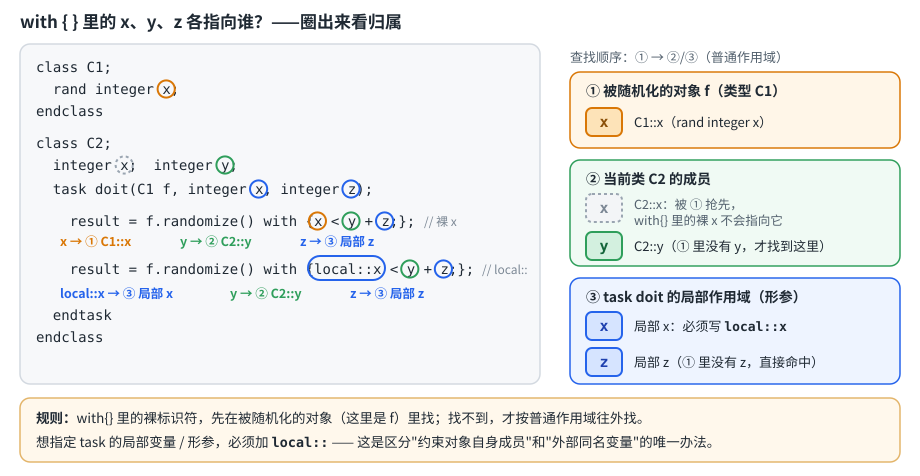
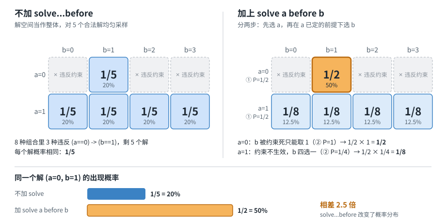

# 随机约束（randomize / constraint）

## 1. 随机数生成函数

```systemverilog
$random(seed)%n;        // 产生随机数范围为 [-(n-1) : (n-1)]（有符号）
{$random(seed)}%n;      // 加花括号强转无符号，范围变成 [0 : (n-1)]，n 为大于0的整数
$random()%(b-a+1)+a;    // 表示 a~b 之间的一个随机整数
$urandom_range(10, 50); // 功能同上，更规范，推荐使用
bit result = std::randomize(a) with {a >= 1};  // 局部变量随机化，result为1成功/0失败
addr = {$urandom, $urandom};  // 拼两个32位随机数凑成64位
number = $urandom & 15;       // 按位与截取低4位，得到[0:15]的4位随机数
object.randomize() with {};   // 类成员随机化，with{}里可临时追加约束（只在本次调用生效）
```

> `$random%n` 加不加花括号，结果的符号范围不一样，容易踩坑。

## 2. inline约束的名字解析（`local::`）—— 易错点

```systemverilog
class C1;
  rand integer x;
endclass

class C2;
  integer x;
  integer y;
  task doit(C1 f, integer x, integer z);
    int result;
    result = f.randomize() with {x < y + z;};
    // x -> class C1 / y -> class C2 / z -> local argument
    result = f.randomize() with {local::x < y + z;};
    // x -> local argument
  endtask
endclass
```

下图把上面两条 `with{}` 里的 `x`、`y`、`z` 分别圈出来，标明各自的归属（橙＝被随机化对象 `f` 的成员，绿＝当前类 `C2` 的成员，蓝＝task 的局部形参，灰虚线＝被抢先、`with{}` 里裸写 `x` 找不到的 `C2::x`）：



**规则**：`with{}` 里的裸标识符，优先绑定到被随机化对象自身（这里是 `f`，即 `C1` 类型）的成员变量，而不是外层局部变量。第一行的 `x` 指的是 `C1::x`；`y` 因为 `C1` 里没有，往外层作用域找到 `C2::y`；`z` 是普通局部形参。

如果确实想引用当前作用域（task的局部形参）里的 `x`，必须显式加 `local::` 前缀。**这是唯一区分"约束对象自身成员"和"外部同名变量"的方式**，是面试高频坑点。

## 3. `rand_mode` / `constraint_mode` / `pre_randomize` / `post_randomize`

```systemverilog
bus.cstr.constraint_mode(0);   // 关闭 bus 对象里名为 cstr 的这一条约束块
bus.constraint_mode(0);        // 关闭 bus 对象上所有的约束块
bus.rand_mode(0);              // bus这个对象的所有rand变量都不再被随机化，保持原值
bus.data.rand_mode(0);         // 只关闭 bus.data 这一个具体变量的随机化
constraint bus::cstr2 { addr > 5; }  // extern constraint写法，类外部扩展约束
pre_randomize();   // randomize()调用前自动执行的钩子函数
post_randomize();  // randomize()调用后自动执行的钩子函数
```

**一句话区分**：`rand_mode` 管的是"变量还随不随机化"，`constraint_mode` 管的是"某条约束还参不参与求解"，两者互不影响、可独立开关，也都能随时用 `(1)` 重新打开。注释"these will change randc behavior"提醒：关闭/打开 `rand_mode` 会影响 `randc` 变量的遍历状态（相当于重置了洗牌记录）。

## 4. soft 约束

```systemverilog
constraint cstr {
  soft data == 1;
  data == 2 -> soft data == 1;
}
```

soft 约束只是一个可被覆盖的默认建议值：只要存在与之冲突的硬约束（或优先级更高/更晚声明的 soft 约束），硬约束一定优先满足，soft 约束会被静默丢弃，**不会**导致 `randomize()` 失败。这是它和普通硬约束最大的区别——硬约束冲突会直接导致 `randomize()` 返回 0。

## 5. dist 权重分布：`:=` vs `:/`

```systemverilog
data dist{0 := 20, [1:3] := 50};
// := 表示区间内每一个值单独获得同样的权重
// 0:1:2:3 = 20 : 50 : 50 : 50

data dist{0 :/ 20, [1:3] :/ 50};
// :/ 表示50是整个区间[1:3]的总权重，会被平均分给区间里的3个值
// 0:1:2:3 = 20 : 50/3 : 50/3 : 50/3
```

## 6. 数组归约约束

```systemverilog
array.sum with (int'(item)) == 50;
array.product with (int'(item)) == 50;
array.and with (int'(item)) == 50;
array.or with (int'(item)) == 50;
array.xor with (int'(item)) == 50;
```

`item` 是 `with()` 子句里系统隐式提供的迭代变量，代表遍历过程中的当前数组元素（这里先做 `int'` 类型转换再求和），不需要用户自己声明，类似 `foreach(array[i])` 的隐式循环变量。整体约束的意思是：数组所有元素（转换为int后）求和必须等于50。

（Mehta 13.6.6 里的例子就是这种写法：`Darray.sum() with (int'(item)) == 30`；普通数组（非约束场景）的归约方法见 3.5.3 Array Reduction Methods。）

## 7. `solve...before` 与概率分布偏置 —— 经典面试坑点

条件：`a` 只能取 `{0,1}`，`b` 只能取 `{0,1,2,3}`，唯一约束：

```systemverilog
constraint c { (a == 0) -> (b == 1); }
```

**不加 `solve...before` 时**：8种组合里有5种满足约束（`(0,1)(1,0)(1,1)(1,2)(1,3)`），求解器把整个解空间当作整体，对这5个解做**均匀采样**，每个解概率都是 `1/5`。

**加上 `solve a before b` 后**：求解器分两步走——

1. 先按 `a` 的定义域均匀选 `a`（各 `1/2`），不考虑约束
2. 再在 `a` 已确定的前提下，对 `b` 在约束限定范围内均匀选：
   - `a=0` 时：`b` 被约束死只能取 `1`，概率 `1`，所以 `P(a=0,b=1) = 1/2 × 1 = 1/2`
   - `a=1` 时：约束不生效，`b` 可任意取，4个值各 `1/2 × 1/4 = 1/8`

**对比**：不加 `solve` 时 `(0,1)` 的概率是 `1/5`，加了 `solve a before b` 之后变成 `1/2`，差了2.5倍。



**结论**：`solve...before` 不只是决定求解顺序、提高求解效率，它会**实实在在改变结果的概率分布**，使其不再是全局均匀。这是DV面试里考察"约束求解器不是黑箱"的高频题。

> 来源说明：Mehta 书中没有讲 `solve...before`。同类题见《Cracking Digital VLSI Verification Interview》第 238 题（该书例子是 `A==0 -> B==0`，本笔记用的是 `b==1` 的变体，结论方向相同）。

## 8. 与 Mehta《Introduction to SystemVerilog》的对应关系

本章对应书中第 13 章 *Constrained Random Test Generation and Verification*。

| 本笔记内容 | Mehta 对应位置 | 备注 |
|---|---|---|
| `$random`/`$urandom`/`$urandom_range` | 13.11 Random Number Generation System Functions（13.11.1 RNG、13.11.3 `srandom`/`get_randstate`/`set_randstate`） | 书中示例用 `$urandom & 'h0000_00ff` 屏蔽高位、`{$urandom, $urandom}` 拼 64 位，与 §1 的写法一致 |
| `randomize() with{}` 内联约束 | 13.10 randomize() with Arguments: In-Line Random | |
| inline 约束名字解析、`local::` | 13.7.2 Local Scope Resolution (local::) | |
| `rand_mode` | 13.8 rand_mode(): Disabling Random Variables | |
| `constraint_mode` | 13.9 constraint_mode(): Control Constraints | 另见 13.4.1 Constraints: Turning On and OFF |
| `pre_randomize()`/`post_randomize()` | 13.7.1 Pre-randomization and Post-randomization | |
| extern 约束 `constraint bus::cstr2{}` | 13.6.1 External Constraint Blocks | 类作用域运算符 `::` 与 `extern` 的通用讲解见 8.15 |
| `dist` 权重分布（`:=` vs `:/`） | 13.6.2 Weighted Distribution | |
| 数组归约约束 `sum() with (int'(item))` | 13.6.6 Array Reduction Methods for Constraint | 普通数组的归约方法见 3.5.3 |
| soft 约束 | 13.6.8 Soft Constraints | 书中还讲了 `disable soft` |
| `solve...before` 概率偏置 | **书中未涉及** | 《Cracking Digital VLSI Verification Interview》第 238 题 |
| `std::randomize(a) with {}` | **书中未涉及**（13.10 只讲对象的 `randomize() with`） | 《Cracking Digital VLSI Verification Interview》第 261 题 |

## 9. 相关笔记

- **依托的语言基础**：`rand` / `randc` 成员和约束块都定义在 class 里（对应后续"类的封装与继承"一章）；§6 的数组归约约束用到 [数组](../01-data-types/04-arrays.md) 的内置方法。
- **下游**：随机约束负责"产生激励"，[功能覆盖率](../04-functional-coverage/README.md) 负责衡量"随机有没有覆盖到该覆盖的场景"，两者合起来就是 coverage-driven verification。
