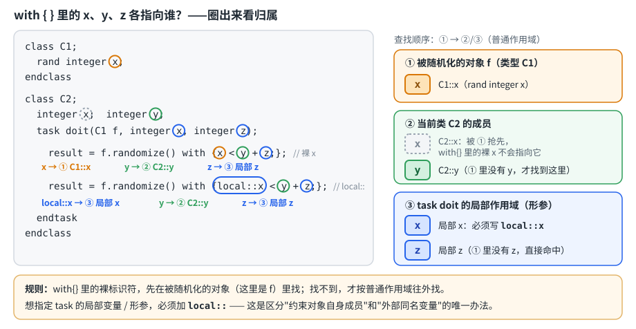
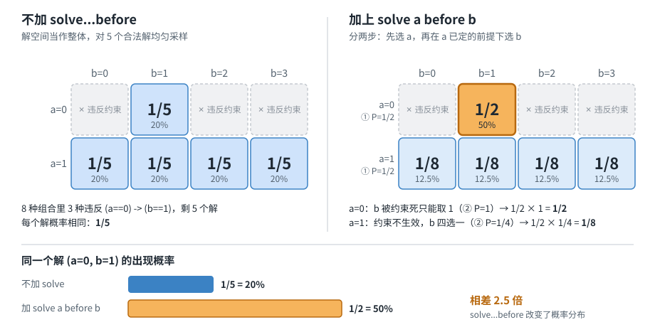

# 随机约束（randomize / constraint）

## 1. 随机数生成函数

```systemverilog
$random(seed)%n;        // 产生随机数范围为 [-(n-1) : (n-1)]（有符号）
{$random(seed)}%n;      // 加花括号强转无符号，范围变成 [0 : (n-1)]，n 为大于0的整数
$random()%(b-a+1)+a;    // 表示 a~b 之间的一个随机整数
$urandom_range(10, 50); // 功能同上，更规范，推荐使用
bit result = std::randomize(a) with {a >= 1};  // 局部变量随机化，result为1成功/0失败
addr = {$urandom, $urandom};  // 拼两个32位随机数凑成64位
number = $urandom & 15;       // 按位与截取低4位，得到[0:15]的4位随机数
object.randomize() with {};   // 类成员随机化，with{}里可临时追加约束（只在本次调用生效）
```

> `$random%n` 加不加花括号，结果的符号范围不一样，容易踩坑。

## 2. transaction 类、rand 变量与 UVM 字段宏

下面以笔记里的 UVM transaction `item` 为例，第 3 节的约束都写在它的约束块里。

### 2.1 rand 变量声明

```systemverilog
class item extends uvm_sequence_item;   // UVM 的 transaction 类：由 sequence 创建，经 sequencer 交给 driver
  rand bit[31:0] data;                   // rand：调用 randomize() 时由求解器挑值；不加 rand 的变量 randomize() 不会动
  rand integer array[];                  // 一维动态数组：元素值和数组长度都会被随机（除非用 array.size() == N 锁定长度）
  rand integer array2[][];               // 二维动态数组（数组的数组）：两个维度的长度和元素值都可以随机
```

> Mehta：13.5 Random Variables (rand and randc)；数组的随机化见 13.5.2 Randomizing Arrays and Queues。

### 2.2 UVM 字段自动化宏

```systemverilog
  `uvm_object_utils_begin(item)                 // 把 item 注册到 UVM factory；transaction 不是组件（没有 phase），所以用 object 版本而不是 component 版本
     `uvm_field_int(data, UVM_ALL_ON)           // 整数型字段交给 UVM 自动处理
     `uvm_field_array_int(array, UVM_ALL_ON)    // 整数数组字段交给 UVM 自动处理
  // 笔记里没写 `uvm_object_utils_end，实际必须和 `uvm_object_utils_begin 成对出现
```

`UVM_ALL_ON` 打开所有自动操作：`copy`、`compare`、`print`、`pack`、`unpack`、`record`，不用再手写 `do_copy`、`do_compare` 这些函数。

> 这部分是 UVM 内容，Mehta 这本 SystemVerilog 书不涉及。

### 2.3 补充：`[7:0]` vs `[0:7]`、动态数组初始化

```systemverilog
bit [7:0] data;                    // 声明里的 [7:0]：8 bit，索引从 7 递减到 0，data[7] 在左边、是最高位
bit [0:7] data;                    // （和上一行是两种写法对比）同样 8 bit，索引从 0 递增到 7，data[0] 在左边、是最高位
data inside {[0:7]};               // inside / bins 里的 [0:7]：表示数值范围 0~7，不是位宽

bit [7:0] array[] = '{200, 100};   // [7:0]：每个元素 8 bit（0~255）；[]：动态数组；'{...}：初始化成 array[0]=200、array[1]=100，size()=2
```

放进 8 bit 元素的值如果超过 255（比如 300），会被截断。

> Mehta：动态数组见 3.3 Dynamic Arrays。

## 3. constraint 块里的各种写法

### 3.1 static 约束

```systemverilog
static constraint cstr { ... }   // static：这条约束的开关（constraint_mode）由所有实例共享，不是每个对象各管各的
```

> Mehta：13.4.1 Constraints: Turning On and OFF（书中提到还有 static constraint）。

### 3.2 soft 约束

```systemverilog
constraint cstr {
  soft data == 1;
  data == 2 -> soft data == 1;
}
```

soft 约束只是一个可被覆盖的默认建议值：只要存在与之冲突的硬约束（或优先级更高/更晚声明的 soft 约束），硬约束一定优先满足，soft 约束会被静默丢弃，**不会**导致 `randomize()` 失败。这是它和普通硬约束最大的区别——硬约束冲突会直接导致 `randomize()` 返回 0。

笔记里 `item` 的 soft 约束：

```systemverilog
soft data == 1;                  // 软性规定 data 为 1
soft array.size() == 1;          // 软性规定数组长度为 1
soft data inside {[1:2], 3};     // 软性规定 data 取 1、2 或 3
! (data inside {[1:2], 3});      // 硬约束（没写 soft）：data 不能是 1、2、3——和上面的 soft 冲突，求解器丢弃冲突的 soft、服从硬约束，不会报无解
```

用 `randomize() with` 从外部覆盖 soft：

```systemverilog
class packet;
  rand bit [7:0] data;
  constraint default_c { soft data == 10; }   // 默认值 10
endclass

p.randomize();                       // 得到 data = 10
p.randomize() with { data == 20; };  // with 里的硬约束覆盖 soft，得到 data = 20
// 如果类里写的是 data == 10（不带 soft），会和 data == 20 冲突，randomize() 失败
```

soft 的意义：transaction 可以提供默认行为，不同 test 不用改 transaction 类就能改变随机结果。

> Mehta：13.6.8 Soft Constraints。

### 3.3 inside 集合约束

```systemverilog
data inside {[1:2], 3};       // [1:2] 是 1~2，整个集合是 {1,2,3}：data 必须是其中之一
! (data inside {[1:2], 3});   // 取反：data 不能是 1、2、3（相当于 data != 1; data != 2; data != 3;）
soft data inside array;       // 笔记原文。语法上 inside 右边必须用大括号，应写成 data inside {array}：data 必须等于 array 里的某个元素
```

> Mehta：12.14 "inside" Operator (Set Membership Operator)（语法是 `<expression> inside {...}`）。

### 3.4 蕴含 `->` 与 if-else

```systemverilog
a == 1 -> soft data == 1;              // 左边成立右边才生效：a==1 时建议 data 为 1；a!=1 时不限制 data（不是强制 data!=1）
if (data == 0)      {array[0] < 10;}   // data==0 时要求 array[0] < 10
else if (data == 1) {array[0] > 100;}  // data==1 时要求 array[0] > 100；data 为其他值时不限制 array[0]
data == 2 -> addr == 1;                // 笔记里没有声明 addr，它也需要是类里的 rand 变量
```

约束里的 `->` 是逻辑蕴含，不是 SVA 里的时序操作符，不涉及下一拍。单个条件用 `->` 简洁，多分支用 if-else 更好读。

> Mehta：13.6.4 Implication and If-Else。

### 3.5 dist 权重分布：`:=` vs `:/`

```systemverilog
data dist{0 := 20, [1:3] := 50};
// := 表示区间内每一个值单独获得同样的权重
// 0:1:2:3 = 20 : 50 : 50 : 50

data dist{0 :/ 20, [1:3] :/ 50};
// :/ 表示50是整个区间[1:3]的总权重，会被平均分给区间里的3个值
// 0:1:2:3 = 20 : 50/3 : 50/3 : 50/3
```

换算成概率：`:=` 的写法总权重是 20 + 50 + 50 + 50 = 170，所以 P(data=0) = 20/170，P(data=1) = P(data=2) = P(data=3) = 50/170；`:/` 的写法总权重是 20 + 50 = 70，P(data=0) = 20/70，1、2、3 各 (50/3)/70。

> Mehta：13.6.2 Weighted Distribution。

### 3.6 unique 唯一性约束

```systemverilog
unique {data, array[0], array[1]};   // 花括号里的量必须两两互不相同：data=1、array[0]=2、array[1]=3 合法；data=1、array[0]=1 不合法
```

> Mehta：13.6.3 "unique" Constraint。

### 3.7 foreach 与数组大小约束

```systemverilog
foreach (array[i])          // 遍历 array 的每个下标 i（数组长度本身是随机的，foreach 自动套到实际长度上）
  array[i] == 1;            // 不管 array 多长，每个元素都等于 1

array2.size() == 2;         // 第一维长度 2：array2[0]、array2[1] 两行
foreach (array2[i])
  array2[i].size() == 3;    // 每一行长度 3 → array2 被约束成 2 行 3 列

foreach(array[i, j]);       // 笔记原文。[i, j] 是二维数组的写法（等价于嵌套两层 foreach），但 array 是一维的，应是 array2[i, j]；而且这里只有分号，没写约束内容
```

> Mehta：13.6.5 Iterative Constraint (foreach)。

### 3.8 数组归约约束

```systemverilog
array.sum with (int'(item)) == 50;       // 所有元素相加：array[0] + array[1] + ... == 50，例如 10 + 15 + 25
array.product with (int'(item)) == 50;   // 所有元素相乘 == 50，例如 2 × 5 × 5
array.and with (int'(item)) == 50;       // 按位与：每个元素该位都是 1，结果该位才是 1
array.or with (int'(item)) == 50;        // 按位或：任意元素该位是 1，结果该位就是 1
array.xor with (int'(item)) == 50;       // 按位异或（相当于奇偶校验）
```

`item` 是 `with()` 子句里系统隐式提供的迭代变量，代表遍历过程中的当前数组元素（这里先做 `int'` 类型转换再求和），不需要用户自己声明，类似 `foreach(array[i])` 的隐式循环变量。整体约束的意思是：数组所有元素（转换为int后）求和必须等于50。

`int'(item)`：归约结果的位宽和元素一样，元素位宽窄时求和、相乘容易截断溢出，先转成 int 再算就能避免。`item` 和覆盖率 `bins ... with (item % 3 == 1)` 里的 `item` 是同一个用法。

这五行是五个独立的语法示例。如果全部放进同一个约束块，数组要同时满足五种结果都等于 50，很可能无解。

（Mehta 13.6.6 里的例子就是这种写法：`Darray.sum() with (int'(item)) == 30`；普通数组（非约束场景）的归约方法见 3.5.3 Array Reduction Methods。）

### 3.9 约束里调用函数

```systemverilog
data == func();                        // data 必须等于 func() 的返回值；比如 func() 返回 10，就相当于 data == 10

class packet;
  rand int data;
  rand int size;
  function int calculate_limit(int x);
    return x * 2;                      // 同样的输入永远得到同样的输出
  endfunction
  constraint c { data <= calculate_limit(size); }   // size=5 时相当于 data <= 10
endclass
```

约束里的函数要像一个纯数学公式：

- 必须有返回值（`void` 函数不能用在 `data == func()` 里）。
- 不能有时间控制（`#10`、`@(posedge clk)`、`wait`）：求解器要在调用 `randomize()` 的当前时刻算完。
- 不要修改外部状态（比如函数里 `count++`）：求解器可能多次调用它，每次结果都不一样。
- 同样的输入要得到同样的输出（不要在里面调 `$urandom_range`）。

> Mehta：13.6.7 Functions in Constraints。

## 4. inline约束的名字解析（`local::`）—— 易错点

```systemverilog
class C1;
  rand integer x;
endclass

class C2;
  integer x;
  integer y;
  task doit(C1 f, integer x, integer z);
    int result;
    result = f.randomize() with {x < y + z;};
    // x -> class C1 / y -> class C2 / z -> local argument
    result = f.randomize() with {local::x < y + z;};
    // x -> local argument
  endtask
endclass
```

下图把上面两条 `with{}` 里的 `x`、`y`、`z` 分别圈出来，标明各自的归属（橙＝被随机化对象 `f` 的成员，绿＝当前类 `C2` 的成员，蓝＝task 的局部形参，灰虚线＝被抢先、`with{}` 里裸写 `x` 找不到的 `C2::x`）：



**规则**：`with{}` 里的裸标识符，优先绑定到被随机化对象自身（这里是 `f`，即 `C1` 类型）的成员变量，而不是外层局部变量。第一行的 `x` 指的是 `C1::x`；`y` 因为 `C1` 里没有，往外层作用域找到 `C2::y`；`z` 是普通局部形参。

如果确实想引用当前作用域（task的局部形参）里的 `x`，必须显式加 `local::` 前缀。**这是唯一区分"约束对象自身成员"和"外部同名变量"的方式**，是面试高频坑点。

## 5. `rand_mode` / `constraint_mode` / `pre_randomize` / `post_randomize`

```systemverilog
bus.cstr.constraint_mode(0);   // 关闭 bus 对象里名为 cstr 的这一条约束块
bus.constraint_mode(0);        // 关闭 bus 对象上所有的约束块
bus.rand_mode(0);              // bus这个对象的所有rand变量都不再被随机化，保持原值
bus.data.rand_mode(0);         // 只关闭 bus.data 这一个具体变量的随机化
constraint bus::cstr2 { addr > 5; }  // extern constraint写法，类外部扩展约束
pre_randomize();   // randomize()调用前自动执行的钩子函数
post_randomize();  // randomize()调用后自动执行的钩子函数
```

**一句话区分**：`rand_mode` 管的是"变量还随不随机化"，`constraint_mode` 管的是"某条约束还参不参与求解"，两者互不影响、可独立开关，也都能随时用 `(1)` 重新打开。注释"these will change randc behavior"提醒：关闭/打开 `rand_mode` 会影响 `randc` 变量的遍历状态（相当于重置了洗牌记录）。

## 6. `solve...before` 与概率分布偏置 —— 经典面试坑点

笔记里 `item` 的约束块也写了 `solve data before addr;`：先随机 `data`，再在 `data` 已确定的前提下随机 `addr`。下面用一道经典题说明它为什么会改变概率。

条件：`a` 只能取 `{0,1}`，`b` 只能取 `{0,1,2,3}`，唯一约束：

```systemverilog
constraint c { (a == 0) -> (b == 1); }
```

**不加 `solve...before` 时**：8种组合里有5种满足约束（`(0,1)(1,0)(1,1)(1,2)(1,3)`），求解器把整个解空间当作整体，对这5个解做**均匀采样**，每个解概率都是 `1/5`。

**加上 `solve a before b` 后**：求解器分两步走——

1. 先按 `a` 的定义域均匀选 `a`（各 `1/2`），不考虑约束
2. 再在 `a` 已确定的前提下，对 `b` 在约束限定范围内均匀选：
   - `a=0` 时：`b` 被约束死只能取 `1`，概率 `1`，所以 `P(a=0,b=1) = 1/2 × 1 = 1/2`
   - `a=1` 时：约束不生效，`b` 可任意取，4个值各 `1/2 × 1/4 = 1/8`

**对比**：不加 `solve` 时 `(0,1)` 的概率是 `1/5`，加了 `solve a before b` 之后变成 `1/2`，差了2.5倍。



8 种组合的完整对照：

| (a, b) | 不加 solve | solve a before b |
|---|---|---|
| (0, 0) | 0 | 0 |
| (0, 1) | 1/5 | **1/2** |
| (0, 2) | 0 | 0 |
| (0, 3) | 0 | 0 |
| (1, 0) | 1/5 | 1/8 |
| (1, 1) | 1/5 | 1/8 |
| (1, 2) | 1/5 | 1/8 |
| (1, 3) | 1/5 | 1/8 |

不加 solve 时，a=0 整体只占 1/5、a=1 占 4/5，a 被约束"连累"得不再是 50/50；`solve a before b` 先把 a 固定成均匀分布。它不会增加或删除合法组合，只改变概率分布。

**结论**：`solve...before` 不只是决定求解顺序、提高求解效率，它会**实实在在改变结果的概率分布**，使其不再是全局均匀。这是DV面试里考察"约束求解器不是黑箱"的高频题。

> 来源说明：Mehta 书中没有讲 `solve...before`。同类题见《Cracking Digital VLSI Verification Interview》第 238 题（该书例子是 `A==0 -> B==0`，本笔记用的是 `b==1` 的变体，结论方向相同）。

## 7. 与 Mehta《Introduction to SystemVerilog》的对应关系

本章对应书中第 13 章 *Constrained Random Test Generation and Verification*。

| 本笔记内容 | Mehta 对应位置 | 备注 |
|---|---|---|
| `$random`/`$urandom`/`$urandom_range` | 13.11 Random Number Generation System Functions（13.11.1 RNG、13.11.3 `srandom`/`get_randstate`/`set_randstate`） | 书中示例用 `$urandom & 'h0000_00ff` 屏蔽高位、`{$urandom, $urandom}` 拼 64 位，与 §1 的写法一致 |
| `rand` 变量、数组随机化 | 13.5 Random Variables (rand and randc)；13.5.2 Randomizing Arrays and Queues | |
| UVM 字段自动化宏 | **书中未涉及** | UVM 内容 |
| `static constraint` | 13.4.1 Constraints: Turning On and OFF | |
| `randomize() with{}` 内联约束 | 13.10 randomize() with Arguments: In-Line Random | |
| inline 约束名字解析、`local::` | 13.7.2 Local Scope Resolution (local::) | |
| `rand_mode` | 13.8 rand_mode(): Disabling Random Variables | |
| `constraint_mode` | 13.9 constraint_mode(): Control Constraints | 另见 13.4.1 Constraints: Turning On and OFF |
| `pre_randomize()`/`post_randomize()` | 13.7.1 Pre-randomization and Post-randomization | |
| extern 约束 `constraint bus::cstr2{}` | 13.6.1 External Constraint Blocks | 类作用域运算符 `::` 与 `extern` 的通用讲解见 8.15 |
| `inside` 集合约束 | 12.14 "inside" Operator (Set Membership Operator) | |
| 蕴含 `->` / if-else | 13.6.4 Implication and If-Else | |
| `dist` 权重分布（`:=` vs `:/`） | 13.6.2 Weighted Distribution | |
| `unique` | 13.6.3 "unique" Constraint | |
| `foreach` 约束 | 13.6.5 Iterative Constraint (foreach) | |
| 数组归约约束 `sum() with (int'(item))` | 13.6.6 Array Reduction Methods for Constraint | 普通数组的归约方法见 3.5.3 |
| 约束中调用函数 | 13.6.7 Functions in Constraints | |
| soft 约束 | 13.6.8 Soft Constraints | 书中还讲了 `disable soft` |
| `solve...before` 概率偏置 | **书中未涉及** | 《Cracking Digital VLSI Verification Interview》第 238 题 |
| `std::randomize(a) with {}` | **书中未涉及**（13.10 只讲对象的 `randomize() with`） | 《Cracking Digital VLSI Verification Interview》第 261 题 |

## 8. 相关笔记

- **依托的语言基础**：`rand` / `randc` 成员和约束块都定义在 class 里（对应后续"类的封装与继承"一章）；§3.8 的数组归约约束用到 [数组](../01-data-types/02.arrays_streaming.md) 的内置方法。
- **下游**：随机约束负责"产生激励"，[功能覆盖率](../04-functional-coverage/01.functional_coverage.md) 负责衡量"随机有没有覆盖到该覆盖的场景"，两者合起来就是 coverage-driven verification。
