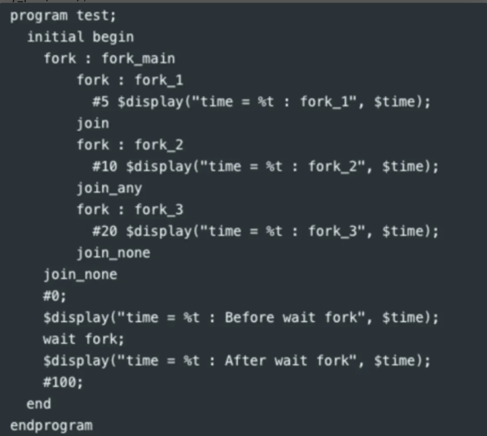

# fork / join 与进程控制（Process Control）

在写并发断言、testbench 里的多线程激励时经常要用到 `fork`，这里单独整理一下 `fork` 的四种"收尾方式"，以及一道综合例题。

## 1. 四种收尾方式

| 写法 | 语义 |
|---|---|
| `fork ... join` | 父线程阻塞，直到 fork 块内**全部**子进程执行完 |
| `fork ... join_any` | 父线程阻塞，直到 fork 块内**任意一个**子进程执行完就继续（对只有一个子进程的 fork 块来说，效果等同于 `join`） |
| `fork ... join_none` | 父线程**不阻塞**，fork 出子进程后立刻继续往下执行，子进程在后台独立运行 |
| `wait fork;` | 阻塞当前进程，直到它**直接或间接派生出的所有子孙进程**（无论当初是用 `join`/`join_any`/`join_none` 中的哪一种派生的）全部结束 |

另外还有 `disable fork;`，可以强制杀死当前进程派生出的所有还在运行的子进程（先记一笔，后续遇到具体例子再补充）。

**最容易搞混的一点**：`join_none` 只是说"这一层 fork 块要不要等它的子进程"，并不代表这些子进程会被"放弃"或者提前终止——它们仍然在后台跑着。`wait fork` 则是不管当初用了哪种收尾方式，一律把所有还在运行的后代进程都等一遍。

## 2. 综合例题



```systemverilog
program test;
  initial begin
    fork : fork_main
        fork : fork_1
          #5 $display("time = %t : fork_1", $time);
        join
        fork : fork_2
          #10 $display("time = %t : fork_2", $time);
        join_any
        fork : fork_3
          #20 $display("time = %t : fork_3", $time);
        join_none
    join_none
    #0;
    $display("time = %t : Before wait fork", $time);
    wait fork;
    $display("time = %t : After wait fork", $time);
    #100;
  end
endprogram
```

### 逐步推演

外层 `initial` 用 `join_none` 派生 `fork_main`——**不等待**，立刻往下走到 `#0;`，所以 "Before wait fork" 在 t=0 附近就打印出来了，根本不会等 `fork_main` 里的三个子 fork 跑完。

与此同时，`fork_main` 自己在 t=0 开始独立运行：

1. 派生 `fork_1`，用的是 `join`——必须等 `fork_1` 跑完（5 个时间单位）才能往下走。→ **t=5：打印 "fork_1"**。
2. 派生 `fork_2`，用的是 `join_any`——`fork_2` 内只有一个子进程，`join_any` 在"任意一个子进程完成"时就放行，对单进程来说效果等同于 `join`，所以还是要等它跑完（10 个时间单位，从 t=5 开始，到 t=15 结束）。→ **t=15：打印 "fork_2"**。
3. 派生 `fork_3`，用的是 `join_none`——不等待，立刻继续。`fork_main` 这个 fork 块本身在这里就算"结束"了（因为它不用等 `fork_3`），但 `fork_3` 这个子进程仍然在后台独立跑着，还需要 20 个时间单位才会真正结束（t=15+20=**t=35**）。→ **t=35：打印 "fork_3"**。

回到最外层 `initial`：在 t≈0 打印完 "Before wait fork" 之后，执行到 `wait fork;`——这里的关键是，`wait fork` 等待的是**这个进程派生出的所有子孙进程**，不管它们是用 `join`、`join_any` 还是 `join_none` 派生的，**全部**都要结束。也就是说，即使 `fork_3` 是用 `join_none` "放养"出去的，`wait fork` 依然会一直等到它跑完为止。所以：

- `wait fork` 要一直等到最慢的那个子孙进程 `fork_3` 结束，也就是 **t=35**。
- **t=35：打印 "After wait fork"**（紧跟在 "fork_3" 之后，因为两者在同一个仿真时刻，`fork_3` 的 `$display` 先执行完，`wait fork` 才检测到"全部子进程已结束"并唤醒主线程）。

### 最终输出顺序

```
time =  0 : Before wait fork
time =  5 : fork_1
time = 15 : fork_2
time = 35 : fork_3
time = 35 : After wait fork
```

## 3. 和 dv笔记里其他并发原语的关系

手写笔记里还提到过几个相关的并发控制原语，放在这里一起复习：

```systemverilog
event e;
-> e;                          // 触发事件
@ e;                           // 阻塞等待事件（如果触发和阻塞同时发生，@ 方式的线程不会被唤醒）
wait(e.triggered);             // 阻塞等待事件（如果触发和阻塞同时发生，wait 方式的线程会被唤醒）
wait_order(e1, e2);            // 要求事件必须按 e1 先、e2 后的顺序发生

semaphore key;
key = new(1);
key.get(1); key.put(1); key.try_get(1);   // 信号量：获取/归还/非阻塞尝试获取

mailbox mbx = new();
mbx.put(item); mbx.try_put(item);
mbx.get(ref item); mbx.try_get(ref item);
mbx.peek(ref item); mbx.try_peek(ref item);
```

`@` 和 `wait(event.triggered)` 的区别是一个容易考到的点：如果触发线程和阻塞线程恰好在同一时刻发生，用 `wait(e.triggered)` 的线程会被正常唤醒，而用 `@e` 的线程反而不会被唤醒（还停留在阻塞状态）——因为 `@` 监听的是事件触发的那个"边沿"，如果线程是在触发的同一时刻才开始等待，就错过了这个边沿。

> 更详细的竞态分析、semaphore 用法见同章的 [02-tasks-process-sync.md](02-tasks-process-sync.md)。

## 4. 自测要点

1. `join_any` 用在只有一个子进程的 fork 块里，和 `join` 有什么区别？（提示：没区别，效果一样）
2. 为什么 "Before wait fork" 几乎在 t=0 就打印，而不是等 `fork_main` 里的三个子 fork 都跑完？
3. `wait fork` 和 `join_none` 的本质区别是什么？（提示：`join_none` 只管"这一层 fork 块要不要等"；`wait fork` 是"扫一遍我派生出的所有后代进程，等它们全部结束"）
4. 如果把最内层的 `join_none`（`fork_3` 那个）改成 `join`，`fork_main` 自己会在什么时候"结束"？这会不会影响外层 `initial` 的行为？（提示：`fork_main` 本身是用 `join_none` 派生的，所以无论它内部怎么改，外层 initial 都不会等它）
5. `@e` 和 `wait(e.triggered)` 在"触发与阻塞同时发生"这种边界情况下，行为有什么不同？
