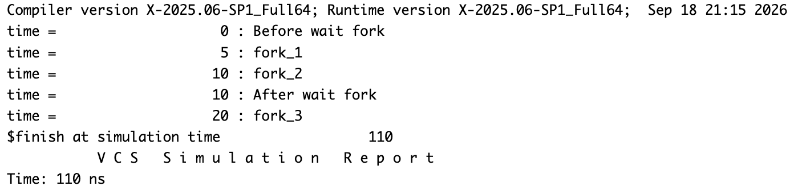
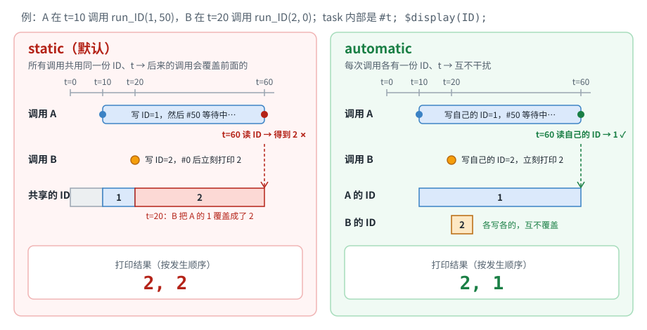
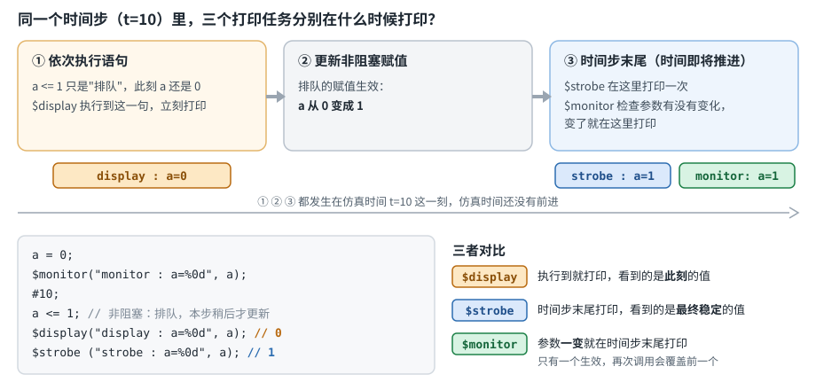

# 进程控制与同步（fork/join · task 生命周期 · event · semaphore · mailbox）

在写并发断言、testbench 里的多线程激励时经常要用到 `fork`。这篇按"线程怎么**启动和收拢**（§1–2）→ 线程启动后会遇到什么坑（§3–4）→ 线程之间怎么**同步和通信**（§5–7）"的顺序整理。

## 1. fork 的四种收尾方式

| 写法 | 语义 |
|---|---|
| `fork ... join` | 父线程阻塞，直到 fork 块内**全部**子进程执行完 |
| `fork ... join_any` | 父线程阻塞，直到 fork 块内**任意一个**子进程执行完就继续（对只有一个子进程的 fork 块来说，效果等同于 `join`） |
| `fork ... join_none` | 父线程**不阻塞**，fork 出子进程后立刻继续往下执行，子进程在后台独立运行 |
| `wait fork;` | 阻塞当前进程，直到它的**所有直接子进程**（immediate children，无论当初是用 `join`/`join_any`/`join_none` 中的哪一种派生的）全部结束。**不等孙进程**（子进程自己再 fork 出来的进程） |

另外还有 `disable fork;`，可以强制杀死当前进程派生出的所有还在运行的子进程（先记一笔，后续遇到具体例子再补充）。

**最容易搞混的两点**：

1. `join_none` 只是说"这一层 fork 块要不要等它的子进程"，并不代表这些子进程会被"放弃"或者提前终止——它们仍然在后台跑着。
2. `wait fork` 等的是**直接子进程**，不是"所有后代"。一个子进程如果用 `join_none` 派生了孙进程然后自己立刻结束，`wait fork` 看到这个子进程已结束就放行，**不会**再等那个还在后台跑的孙进程（见 §2 例题里的 `fork_3`）。

> "子进程"怎么数：fork 块里**每一条并列的语句**各是一个子进程；一条语句内部再 fork 出来的进程是孙进程。

## 2. fork 综合例题

```systemverilog
program test;
  initial begin
    fork : fork_main
        fork : fork_1
          #5 $display("time = %t : fork_1", $time);
        join
        fork : fork_2
          #10 $display("time = %t : fork_2", $time);
        join_any
        fork : fork_3
          #20 $display("time = %t : fork_3", $time);
        join_none
    join_none
    #0;
    $display("time = %t : Before wait fork", $time);
    wait fork;
    $display("time = %t : After wait fork", $time);
    #100;
  end
endprogram
```

### 逐步推演

**先看进程层次**。`fork : fork_main ... join_none` 里面并排写了三个内层 fork——它们是 `fork_main` 的**三条并列分支**（不是 `begin...end` 里的先后顺序），所以 t=0 时**同时启动**，并且都是外层 `initial` 的直接子进程：

```
initial（外层进程）
 └─ fork_main（join_none）── 三条并列分支，t=0 同时启动 = initial 的 3 个直接子进程
     ├─ 分支1：fork_1（join）      ── 孙进程：#5  打印 fork_1
     ├─ 分支2：fork_2（join_any）  ── 孙进程：#10 打印 fork_2
     └─ 分支3：fork_3（join_none） ── 孙进程：#20 打印 fork_3
```

**时间线**：

| 时刻 | 发生了什么 |
|---|---|
| t=0 | `initial` 用 `join_none` 派生 `fork_main`，**不等待**，往下走到 `#0;`（让出一次调度，三条分支得以启动），打印 **"Before wait fork"**，然后停在 `wait fork;` 上。<br>三条分支各自派生孙进程：分支1（`join`）和分支2（`join_any`）要等自己的孙进程；分支3 用 `join_none`，派生完 `fork_3` 的孙进程后**立刻结束**，孙进程（`#20`）留在后台 |
| t=5 | 分支1 的孙进程打印 **"fork_1"**，`join` 满足，分支1 结束 |
| t=10 | 分支2 的孙进程打印 **"fork_2"**，`join_any` 放行，分支2 结束。<br>至此 `initial` 的 3 个直接子进程（分支1/2/3）**全部结束** → `wait fork` 返回 → 打印 **"After wait fork"**（紧跟在 "fork_2" 之后，因为分支2 要等 `fork_2` 的 `$display` 执行完才能结束） |
| t=20 | 分支3 派生的 `fork_3` 孙进程（一直在后台跑）打印 **"fork_3"**——`wait fork` 不等孙进程，所以它比 "After wait fork" 晚 |
| t=110 | `wait fork` 在 t=10 返回后还有 `#100;`，10+100=110，与 VCS 报告里的 `$finish at simulation time 110` 吻合 |

**易错点小结**：
- "fork_2 在 t=10 而不是 t=15"——因为三个内层 fork 是**并行**的，`fork_2` 不需要等 `fork_1` 跑完再启动。
- "After wait fork 在 t=10 而不是 t=20"——`wait fork` 只等直接子进程，`fork_3` 的 `#20` 是孙进程，不在等待范围内。

### 最终输出顺序

```
time =  0 : Before wait fork
time =  5 : fork_1
time = 10 : fork_2
time = 10 : After wait fork
time = 20 : fork_3
```

VCS 实测输出（`%t` 在 VCS 里会带宽度填充，上面为了对齐省略了多余空格；输出顺序和时间戳完全一致）：



## 3. `automatic` vs `static` 任务 —— 并发竞态经典案例

**先记区别**（task 在 class 之外默认是 `static`）：

| | `static` | `automatic` |
|---|---|---|
| 存储 | 整个仿真期间只有**一份**，所有调用共用 | **每次调用**各分配一份，调用结束即释放 |
| 并发 / 重入调用 | 变量互相覆盖 | 互不干扰，可以安全并发、递归 |
| 局部变量初值 | 只在仿真开始时初始化一次，之后保留上一次调用留下的值 | 每次调用进入时重新初始化 |
| 什么时候用 | 需要在多次调用之间保留状态 | 会被 `fork` 并发调用或递归调用的 task / function；验证环境里几乎都该显式写 `automatic` |

再看下面这个经典例子：

```systemverilog
initial begin
  fork
    #10 run_ID(1, 50);
    #20 run_ID(2, 0);
  join
end

task automatic run_ID (int ID, int t);
  #t;
  $display("%d", ID);
endtask
//automatic : 2, 1
//static    : 2, 2
```

时间线：
- 分支A：时刻10调用 `run_ID(1, 50)` → 内部 `#50` 延迟 → 时刻60执行 `$display`
- 分支B：时刻20调用 `run_ID(2, 0)` → 内部 `#0` 延迟（几乎立即）→ 时刻20执行 `$display`



**如果是 `automatic`**：每次调用都各自拥有独立的一份 `ID`、`t` 存储空间，两次调用互不干扰。按实际完成时间排序：分支B先在时刻20打印`2`，分支A后在时刻60打印`1`。输出顺序：**2, 1**。

**如果是 `static`**（默认情况，且被并发重入调用时）：`ID`、`t` 是全局唯一的一份存储，被所有调用共享。分支A在时刻10把共享的`ID`设为1，进入50时长的等待（`#t`延迟量在语句执行的那一刻求值一次并锁定，不会再变）；但在它还没醒来之前，时刻20分支B把同一个共享的`ID`覆盖成了2。等到时刻60分支A的延迟结束、真正执行`$display("%d", ID)`时，读到的`ID`已经是被分支B改写过的**2**，不是它自己原本的1。所以两次打印都是**2, 2**——这是共享静态局部变量在并发场景下"互相踩踏"的经典bug，也是为什么验证代码里几乎所有task都要显式加`automatic`。

> Mehta：22.1.1 Static and Automatic Tasks（讲的是同一原理：static task 被同时调用时，变量会互相覆盖）。

## 4. 打印类系统任务

```systemverilog
$display: 打印当前值
$strobe: 打印当前时间step结束时的值（这里的step与`timescale的声明有关）
$monitor: 假如任何值发生更改，则在当前时间步的末尾打印值
          同时$monitor只能调用一次，顺序调用将覆盖前一个
```

- `$display`：打印**当前时刻**的值，语句执行时立即打印。
- `$strobe`：打印当前时间步（time step）**结束时**的值——保证拿到这个时间步里最终稳定的值，而不是中间态。
- `$monitor`：只要监控的信号发生任何变化，就在当前时间步末尾自动打印一次。**全局只能生效一个**，后调用的会覆盖前一个（不是叠加）。

下图用最经典的"非阻塞赋值 + 三个打印"说明三者的差别：同一个时间步里，`$display` 在语句执行时就打印，看到的还是赋值前的旧值；`$strobe` / `$monitor` 都等到时间步末尾，看到的是更新后的值。



> Mehta：25.1 Display Tasks。

## 5. 事件阻塞：`@` vs `wait(event.triggered)`

```systemverilog
event e;
-> e;               // 触发事件
@e;                 // 阻塞直到事件被触发（边沿触发型）
wait(e.triggered);  // 阻塞直到事件被触发（电平/状态型）
wait_order(e1, e2); // 要求必须先等到e1触发，再等到e2触发，顺序不对会报错
```

这是SV里一个隐蔽的**竞争(race)问题**，也是容易考到的点：

- `@e` 是**边沿检测**：只关心"触发"这个动作本身。如果触发发生的那一刻，线程还没执行到`@e`这一句（哪怕只差一个仿真步的调度顺序），这次触发就相当于没发生，线程会继续阻塞，得等下一次`->e`。
- `wait(e.triggered)` 是**状态检测**：`e.triggered`是一个在当前时间步内会保持为真的状态标志，不是转瞬即逝的动作。无论检查语句在触发之前还是之后被调度，只要在同一个时间步内，查到的都是"已触发"，会立刻结束阻塞。

如果`->e`和某个线程执行到`@e`/`wait(e.triggered)`恰好被调度在同一个仿真时刻，谁先谁后取决于仿真器内部事件队列调度顺序，用户无法控制：用`wait(e.triggered)`的线程会被正常唤醒，而用`@e`的线程可能错过这个边沿、继续阻塞。这也是为什么很多验证代码更推荐用`wait(event.triggered)`而不是裸`@event`来做跨线程同步。

> Mehta：2.12 Event Data Type（书中写明"`wait` 无论在触发之前还是同一仿真时刻执行，都会被这次触发唤醒"）、2.12.1 Event Sequencing: wait_order()、16.5 Named Event Time Control。

## 6. 信号量 semaphore

```systemverilog
semaphore key;
key = new(1);        // 创建一个信号量，初始有1把"钥匙"（可用资源数为1）
key.get(1);           // 阻塞式获取1把钥匙，不够就一直等
key.put(1);           // 归还1把钥匙
key.try_get(1);       // 非阻塞式尝试获取，成功返回1、失败返回0，不会卡住
```

用于验证环境里限制**同一时间只允许N个线程访问某资源**（比如共享总线），`get`/`put`是最常用的一对，`try_get`适合"能拿就拿，拿不到就跳过"的场景。

> Mehta：18.1 Semaphores。

## 7. 邮箱 mailbox

```systemverilog
mailbox mbx = new();
mbx.put(item); mbx.try_put(item);
mbx.get(ref item); mbx.try_get(ref item);
mbx.peek(ref item); mbx.try_peek(ref item);
```

mailbox 是线程之间传递数据的队列：`put`/`get` 是阻塞版本，`try_put`/`try_get` 是非阻塞版本，`peek` 只看队首、不取走。

## 8. 与 Mehta《Introduction to SystemVerilog》的对应关系

本章分散在书中第 16 章 *SystemVerilog Processes*、第 18 章 *Inter-process Synchronization. Semaphores and Mailboxes*，以及第 2、22、25 章的相关小节。

| 本笔记内容 | Mehta 对应位置 | 备注 |
|---|---|---|
| `fork ... join / join_any / join_none`（§1–2） | 16.3 Parallel Blocks: fork-join（16.3.1 fork-join、16.3.2 fork-join_any、16.3.3 fork-join_none） | |
| `wait fork` 只等直接子进程（§1–2） | 16.4.1 Wait Fork | 书中示例注释写明 `wait fork` "will not wait for descendant1 and descendant2"，正文说等的是 immediate concurrent processes，与 §2 的 VCS 实测一致 |
| `disable fork` | 16.7 Disable Statement | 书中只讲 `disable` 命名块/任务，**没有单独讲 `disable fork`** |
| `automatic` vs `static` 并发竞态（§3） | 22.1.1 Static and Automatic Tasks；2.8 Static, Automatic, and Local Variables（2.8.3 Variable Lifetimes）；22.2.4 Static and Automatic Functions | 22.1.1 讲 static task 被同时调用时变量互相覆盖，与 §3 原理一致 |
| `$display` / `$strobe` / `$monitor`（§4） | 25.1 Display Tasks；23.1 Procedural Assignments | 25.1 把 `$monitor` 描述为 continuous monitoring（变量变化时在时间步末尾打印）；23.1 建议用 `$strobe` 打印非阻塞赋值的结果。"`$monitor` 全局只能生效一个"书中未明确写 |
| event 基础、`@` vs `wait(e.triggered)`（§5） | 2.12 Event Data Type；16.5 Named Event Time Control | 2.12 写明 `wait(e.triggered)` 无论在触发之前还是同一时刻执行都会被唤醒 |
| `wait_order(e1, e2)`（§5） | 2.12.1 Event Sequencing: wait_order() | |
| semaphore（`new/get/put/try_get`）（§6） | 18.1 Semaphores | |
| mailbox（`put/get/peek` 及 `try_` 版本）（§7） | 18.2 Mailboxes（18.2.1 Parameterized Mailbox） | |

## 9. 自测要点

1. `join_any` 用在只有一个子进程的 fork 块里，和 `join` 有什么区别？（提示：没区别，效果一样）
2. 为什么 "Before wait fork" 几乎在 t=0 就打印，而不是等 `fork_main` 里的三个子 fork 都跑完？
3. `wait fork` 和 `join_none` 的本质区别是什么？（提示：`join_none` 只管"这一层 fork 块要不要等"；`wait fork` 是"等我所有**直接子进程**结束"，不等孙进程）
4. 为什么例题里 "fork_2" 在 t=10 而不是 t=15？三个内层 fork 之间是什么关系？（提示：它们是 `fork_main` 的并列分支，t=0 同时启动）
5. 为什么 "After wait fork" 在 t=10 打印，比 "fork_3"（t=20）还早？如果把 `fork_3` 那个 `join_none` 改成 `join`，"After wait fork" 会在什么时候打印？（提示：改成 `join` 后分支3 要等 `#20` 的孙进程，成了 t=20 才结束的直接子进程；此时输出是 "fork_3" 在前、"After wait fork" 在后，都在 t=20）
6. `@e` 和 `wait(e.triggered)` 在"触发与阻塞同时发生"这种边界情况下，行为有什么不同？
7. `run_ID` 例子里，为什么 `automatic` 输出 `2, 1`，而 `static` 输出 `2, 2`？
8. `$display`、`$strobe`、`$monitor` 分别在什么时候打印？连续调用两次 `$monitor` 会怎样？
9. semaphore 的 `get` 和 `try_get` 有什么区别？各适合什么场景？
