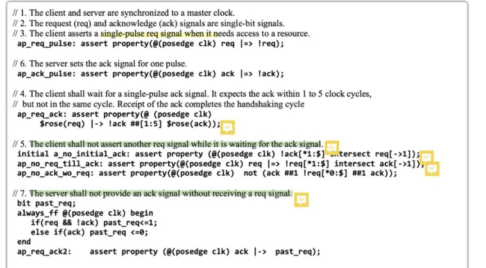
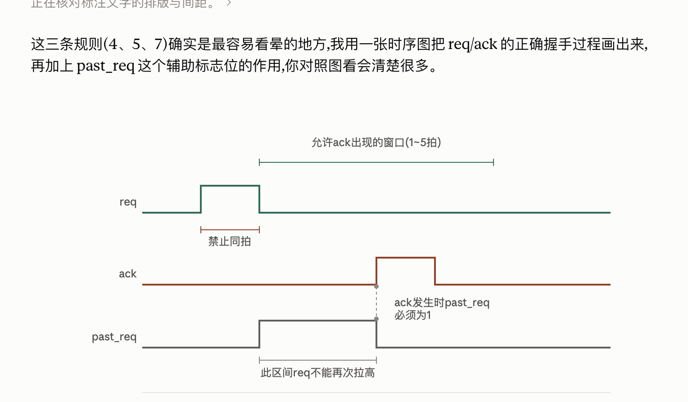

# 综合案例：req / ack 握手协议断言

这一课把前面学的 `|->`/`|=>`、`intersect`、`not`、采样值函数、影子寄存器（shadow register）技巧全部串起来，用一个真实的 req/ack 握手协议规格作为综合练习。

## 1. 协议规格（原始英文文字规格，共 7 条）

1. The client and server are synchronized to a master clock.
2. The request (req) and acknowledge (ack) signals are single-bit signals.
3. The client asserts a single-pulse req signal when it needs access to a resource.
4. The client shall wait for a single-pulse ack signal. It expects the ack within 1 to 5 clock cycles, but not in the same cycle. Receipt of the ack completes the handshaking cycle.
5. The client shall not assert another req signal while it is waiting for the ack signal.
6. The server sets the ack signal for one pulse.
7. The server shall not provide an ack signal without receiving a req signal.

## 2. 断言代码（按原始笔记顺序，注释标出对应规格编号）



```systemverilog
// 1. The client and server are synchronized to a master clock.
// 2. The request (req) and acknowledge (ack) signals are single-bit signals.
// 3. The client asserts a single-pulse req signal when it needs access to a resource.
ap_req_pulse: assert property(@(posedge clk) req |=> !req);

// 6. The server sets the ack signal for one pulse.
ap_ack_pulse: assert property(@(posedge clk) ack |=> !ack);

// 4. The client shall wait for a single-pulse ack signal. It expects the ack within 1 to 5 clock cycles,
//    but not in the same cycle. Receipt of the ack completes the handshaking cycle.
ap_req_ack: assert property(@(posedge clk)
    $rose(req) |-> !ack ##[1:5] $rose(ack));

// 5. The client shall not assert another req signal while it is waiting for the ack signal.
initial a_no_initial_ack: assert property (@(posedge clk) !ack[*1:$] intersect req[->1]);
ap_no_req_till_ack: assert property(@(posedge clk) req |=> !req[*1:$] intersect ack[->1]);
ap_no_ack_wo_req: assert property(@(posedge clk)  not (ack ##1 !req[*0:$] ##1 ack));

// 7. The server shall not provide an ack signal without receiving a req signal.
bit past_req;
always_ff @(posedge clk) begin
   if (req && !ack) past_req <= 1;
   else if (ack)     past_req <= 0;
end
ap_req_ack2: assert property (@(posedge clk) ack |-> past_req);
```

> 注：`initial a_no_initial_ack: assert property (...)` 这一行按原始笔记原样保留；从命名看它检查的是"仿真最开始、第一次 req 出现之前不应该有 ack"这种边界情况，和下面 `ap_no_req_till_ack` / `ap_no_ack_wo_req` 一起，从三个角度共同覆盖规格 5。

## 3. 时序图：req / ack / past_req 的关系



ASCII 版本（方便在不支持图片的地方查看）：

```
                     |<---------- 允许 ack 出现的窗口 (1~5 拍) ---------->|
clk      : _|‾|_|‾|_|‾|_|‾|_|‾|_|‾|_|‾|_|‾|_|‾|_
req      : ______/‾‾‾\_______________________________________
              |<-禁止同拍->|
ack      : ______________________________________/‾‾‾\_______
past_req : __________/‾‾‾‾‾‾‾‾‾‾‾‾‾‾‾‾‾‾‾‾‾‾‾‾‾‾‾‾\____________
                      ^                            ^
                req 到来，                    ack 到来时，
                past_req 置 1               past_req 必须已经是 1
                     |<------ 此区间 req 不能再次拉高 ------>|
```

## 4. 逐条拆解

### 4.1 `ap_req_pulse` / `ap_ack_pulse`（规格 3、6）：单周期脉冲

`req |=> !req` 意思是：`req` 拉高的下一拍必须回落，即 `req` 只能保持 1 拍（不能连续拉高两拍以上）。`ap_ack_pulse` 用同样的写法约束 `ack`。

### 4.2 `ap_req_ack`（规格 4）：握手窗口 + 禁止同拍

```systemverilog
ap_req_ack: assert property(@(posedge clk)
    $rose(req) |-> !ack ##[1:5] $rose(ack));
```

- `$rose(req)` 命中的那一拍，**当拍** `ack` 必须为 0（`!ack`）—— 这就是时序图里"禁止同拍"的来源：如果 `ack` 跟 `req` 同一拍出现，这条断言直接失败。
- 之后 1~5 拍内必须等到 `$rose(ack)`，对应时序图里"允许 ack 出现的窗口"。

### 4.3 `a_no_initial_ack` / `ap_no_req_till_ack` / `ap_no_ack_wo_req`（规格 5）：等待期间不能连发 req

这三条从不同角度共同保证"一次握手完成之前，不能再发第二次 req"：

- **`a_no_initial_ack`**：仿真最开始（第一次 req 之前）不应该无缘无故先出现一次 ack。
- **`ap_no_req_till_ack`**：`req` 拉高之后，在下一次 `ack` 出现之前，`req` 不能再次拉高——用 `intersect` 把"`req` 保持低直到 `ack` 出现"这段区间和"直到 `ack` 出现（`ack[->1]`）"这段区间要求精确对齐（同时开始、同时结束）。
- **`ap_no_ack_wo_req`**：用 `not(...)` 排除"两次 `ack` 之间没有 `req` 插入"这种非法情况。

### 4.4 `ap_req_ack2`（规格 7）：`past_req` 影子寄存器

```systemverilog
bit past_req;
always_ff @(posedge clk) begin
   if (req && !ack) past_req <= 1;
   else if (ack)     past_req <= 0;
end
ap_req_ack2: assert property (@(posedge clk) ack |-> past_req);
```

`past_req` 是额外维护的一个"影子标志位"：

- `req` 到来且还没收到 `ack` 时，把 `past_req` 置 1（表示"当前有一个 req 正等待 ack"）。
- `ack` 一到，`past_req` 清零。

`ap_req_ack2: ack |-> past_req` 要求：**任何时候 `ack` 出现，`past_req` 必须已经是 1**——也就是说，`ack` 之前一定发生过一次尚未被响应的 `req`。这就是"影子寄存器"技巧在真实案例里的样子：不直接对 `req`/`ack` 的时序关系做复杂的窗口匹配，而是用一个额外的状态位把"协议历史"记录下来，再用一条简单的组合断言去检查它。

> Mehta：14.17.5 `$past`（14.17.5.1 Application: `$past()`）。

## 5. 自测要点

1. 为什么 `ap_req_ack` 里要写 `!ack ##[1:5] $rose(ack)` 而不是直接写 `##[1:5] $rose(ack)`？（提示：如果不加 `!ack`，会漏掉"不能同拍响应"这条约束）
2. `past_req` 在什么时候被置 1、什么时候被清 0？它解决的是规格里的第几条？
3. `ap_no_req_till_ack` 里为什么用 `intersect` 而不是直接用 `##[1:5]` 这种延迟操作符？
4. 如果去掉 `ap_req_ack2`，只靠 `ap_no_ack_wo_req` 一条断言，能不能完整覆盖规格 7？两者的检查角度有什么不同？

## 6. 延伸：更复杂协议下的 ID 匹配技巧

上面的基础案例假设同一时刻最多只有一个"未完成的握手"。如果协议允许背靠背（back-to-back）的多个 req 同时在途、要求每个 req 精确匹配到属于自己的那个 ack，就需要用到 **local variable** 技巧。教材 14.21 节用一个几乎同构的例子（`rdy` / `rdyAck`）说明了这个陷阱以及正确解法。

### 6.1 有问题的写法（无法保证一一对应）

```systemverilog
sequence rdyAckCheck;
  (1'b1, $display($stime,,,"ENTER SEQUENCE rdy ARRIVES"))
  ##[1:5]
  ((rdyAck), $display($stime,,,"rdyAck ARRIVES"));
endsequence

gcheck: assert property (@(posedge clk) rdy |-> rdyAckCheck)
  begin $display($stime,,,"PASS"); end
  else begin $display($stime,,,"FAIL"); end
```
如果两个 `rdy` 挨着来，中间只有一个 `rdyAck`，这个属性依然会 PASS 两次——因为它只检查"5 拍内有没有 rdyAck"，不检查"是不是专门对应这一次 rdy 的"。

### 6.2 正确写法：local variable 逐次打标签

```systemverilog
sequence rdyAckCheck;
  byte localData;                       // local variable：每次进入 sequence 都会创建一个新实例，
                                         // 相当于给每一次 rdy 单独开一个线程去追踪，不用手动维护流水线状态

  (1'b1, localData = rdyNum,
   $display($stime,,,"rdy ARRIVES: ",,,"LOCAL rdyNum=", localData))
  ##[1:5]
  ((rdyAck && rdyAckNum == localData),
   $display($stime,,,"rdyAck ARRIVES ",,,"LOCAL",,,
            "rdyNum=", localData,,, "rdyAck=", rdyAckNum));
endsequence

gcheck: assert property (@(posedge clk) (rdy) |-> rdyAckCheck)
  begin $display($stime,,,"PASS"); end
  else begin $display($stime,,,"FAIL",,,"rdyNum=", rdyNum,,,"rdyAckNum=", rdyAckNum); end
```

关键技巧拆解：
- **local variable 是"动态"的**：sequence 每被触发一次（每次 `rdy` 命中），都会 fork 出一份独立的 `localData`，不会和上一次的实例互相覆盖——不需要你手动写队列/计数器去维护"流水线中有几个 rdy 还没等到 ack"。
- **逗号采样动作（`, localData = rdyNum`）**：在序列匹配的某个节点上顺便执行一个赋值/打印动作，把"当前这次 rdy 对应的编号"记下来。
- **匹配条件里再比对**：`rdyAck && rdyAckNum == localData` —— 不仅要求 `rdyAck` 出现，还要求它带的编号跟这个线程当初记下来的编号**完全一致**，才算这次 rdy 真正等到了属于自己的 ack。
- 时间窗口：本例用的是 `##[1:5]`；如果把同样的技巧套到本篇的 req/ack 协议上（允许多个 req 同时在途），只需把 `##[1:5]` 换成协议要求的窗口即可。

### 6.3 与基础版的关系

| | 基础版（第 1-5 节） | 进阶版（本节） |
|---|---|---|
| 能否处理背靠背（back-to-back）请求 | 不行，`past_req` 只记录"是否存在一个未完成握手"，无法区分具体是哪一次 | 可以，每个请求独立追踪 |
| 关键机制 | `past_req` 影子寄存器 + `intersect` 精确对齐 | `local variable` 给每次请求单独开线程 + 显式比对 ID |
| 复杂度 | 低，适合协议简单、请求稀疏（一次只有一个未完成握手）的场景 | 略高，但能覆盖请求密集、允许多个未完成事务并行的场景（更贴近真实总线协议） |

### 6.4 自测要点

1. 为什么"两个 req 挨着来，只看超时窗口内有没有 ack"这种检查方式不够严谨？
2. local variable 在 sequence 里是"静态"还是"动态"的？这意味着什么？
3. `localData = rdyNum` 这种写法叫什么？它在序列匹配的哪个阶段执行？
