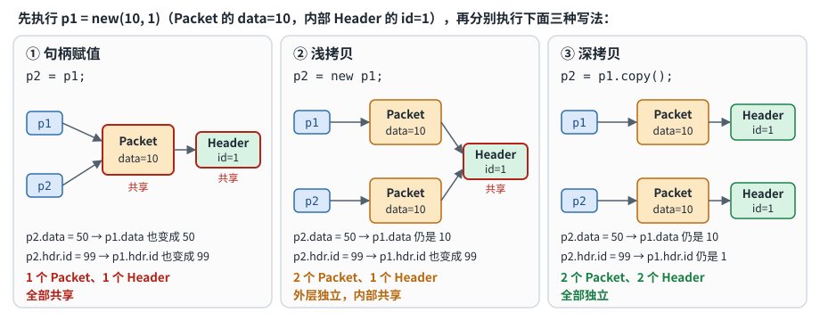

# Class 基础：class / object / handle、构造函数、static、封装、拷贝、作用域

## 1. class、object、handle

```systemverilog
class Packet;                  // class：用户自定义的数据类型，把数据和操作数据的方法封装在一起，本身只是"模板"
  int data;                    // 成员变量

  function void print();       // 成员方法
    $display("data = %0d", data);
  endfunction
endclass

Packet p;                      // 只声明了一个 Packet 类型的 handle，此时 p -> null，还没有 object
p = new();                     // new() 才真正创建 object（在内存里"开辟空间"放它和它的成员），并让 p 指向它
```

```text
执行 new() 前：  p -> null

执行 new() 后：  p
                 |
                 v
              +----------------+
              | Packet object  |
              | data           |
              +----------------+
```

四句话记住：

```text
class   = 模板 / 类型
object  = 真正创建出来的实体
handle  = 指向（引用）object 的变量，本身不是 object
new()   = 创建 object
```

### 1.1 多个 handle 可以指向同一个 object

```systemverilog
Packet p1, p2, p3;

p1 = new(10);     // Object 1（data=10）
p2 = p1;          // 没有 new：p2 和 p1 指向同一个 Object 1
p3 = new(30);     // Object 2（data=30）
```

```text
p1 --+
     +--> Object 1 (data=10)          3 个 handle：p1、p2、p3
p2 --+                                2 个 object
p3 -----> Object 2 (data=30)
```

判断有几个 object：**数真正执行了几次 `new()`**。p1、p2 指向同一个 object，所以 `p1.data = 100;` 之后 `p2.data` 也是 100。

> Mehta：8.1 Basics。

## 2. 构造函数 `new()` 与 `this`

```systemverilog
class Packet;
  int data;

  function new(int d);         // 构造函数：名字固定为 new，创建 object 时自动执行，用来初始化成员、创建内部子对象
    data = d;
  endfunction
endclass

Packet p = new(10);            // 声明和创建可以写在一起；10 按位置传给形参 d，再由 data = d 存进成员：10 → d → data
```

参数和成员同名时，用 `this` 区分：

```systemverilog
class Packet;
  int data;

  function new(int data);
    this.data = data;          // this.data：当前 object 的成员；data：new() 的参数——把参数存进当前 object 的成员
  endfunction
endclass

Packet p1 = new(10);           // 创建 p1 时，this 指向 p1 的 object
Packet p2 = new(20);           // 创建 p2 时，this 指向 p2 的 object
```

> Mehta：8.4 Class Constructor；8.7 "this"。

## 3. 普通成员与 `static` 成员

一句话：**没有 `static`，每个 object 自己一份；有 `static`，整个 class 共享一份。**

```systemverilog
class Packet;
  int count = 0;               // 普通成员：每个 object 各有一份
  function void add();
    count++;
  endfunction
endclass

Packet p1 = new(), p2 = new();
p1.add(); p1.add(); p2.add();  // 结果：p1.count = 2，p2.count = 1
```

```systemverilog
class Packet;
  static int count = 0;        // static 成员：属于整个 class，所有 object 共享一份
  function void add();
    count++;
  endfunction
endclass

Packet p1 = new(), p2 = new();
p1.add(); p1.add(); p2.add();  // 结果：Packet::count = 3
```

典型用途是统计一共创建了多少个对象：

```systemverilog
class Packet;
  int data;
  static int count = 0;

  function new(int data);
    this.data = data;
    count++;                   // 每 new 一次加 1
  endfunction
endclass

p1 = new(10);                  // count = 1
p2 = p1;                       // 没有 new，count 不变
p3 = new(20);                  // count = 2
$display("count = %0d", Packet::count);   // 用 类名::成员 访问 static 成员
```

### 3.1 static 方法

```systemverilog
class Packet;
  static int count;

  static function void show_count();   // static 方法：没有"当前 object"，所以只能直接访问 static 成员，不能访问普通成员
    $display("count = %0d", count);
  endfunction
endclass

Packet::show_count();                  // 不用创建 object，直接通过类名调用
```

| 成员类型 | 存储份数 | 表示什么 |
|---|---|---|
| 普通成员 | 每个 object 各一份 | object 自己的状态（比如 `data`） |
| `static` 成员 | 整个 class 共享一份 | 所有 object 共同的信息（比如 `count`） |

> Mehta：8.5 Static Properties；8.6 Static Methods。

## 4. 封装：`local` / `protected`

封装就是把数据和操作数据的方法放在同一个类里，并控制外部能访问哪些内容。

```systemverilog
class BankAccount;
  local int balance;                     // local：只有这个类内部能直接访问

  function new(int initial_balance);
    balance = initial_balance;
  endfunction

  function void deposit(int amount);     // 外部只能通过方法改余额，类可以在这里检查数据是否合法
    if (amount > 0)
      balance += amount;
  endfunction

  function int get_balance();
    return balance;
  endfunction
endclass

account.balance = -1000;                 // 编译错误：local 成员，类外不能访问
account.deposit(100);                    // 正确：通过类提供的方法访问
$display("%0d", account.get_balance());
```

不写访问修饰符时，成员默认对外公开（`p.data = 10;` 可以直接写）。

| 权限 | 当前类 | 子类 | 类外部 |
|---|---|---|---|
| 默认（公开） | 可以 | 可以 | 可以 |
| `protected` | 可以 | 可以 | 不可以 |
| `local` | 可以 | 不可以 | 不可以 |

> Mehta：8.14 Data Hiding ("local," "protected," "const") and Encapsulation。

## 5. 句柄赋值、浅拷贝、深拷贝

下面三种写法都用同一组类：`Packet` 里既有普通数据 `data`，也有一个指向 `Header` object 的句柄 `hdr`。

```systemverilog
class Header;
  int id;
  function new(int id = 0);
    this.id = id;
  endfunction
endclass

class Packet;
  int data;
  Header hdr;                  // 成员里还有一个 class handle
  function new(int data = 0, int id = 0);
    this.data = data;
    hdr = new(id);             // 构造时顺便创建内部的 Header object
  endfunction
endclass

Packet p1 = new(10, 1);        // p1：data=10，内部 Header 的 id=1
Packet p2;
```



### 5.1 句柄赋值：`p2 = p1`

```systemverilog
p2 = p1;                       // 只复制 handle，不创建任何 object：p1、p2 指向同一个 Packet，Header 也是同一个
p2.data = 50;                  // p1.data 也变成 50
p2.hdr.id = 99;                // p1.hdr.id 也变成 99
```

### 5.2 浅拷贝：`p2 = new p1`

```systemverilog
p2 = new p1;                   // 创建一个新的 Packet，把 p1 的成员逐个复制过去；hdr 是 handle，只复制了指向，没有新建 Header
p2.data = 50;                  // p1.data 仍是 10（外层 Packet 是两个）
p2.hdr.id = 99;                // p1.hdr.id 也变成 99（内部 Header 还是同一个）
```

浅拷贝只把**第一层** object 分开，内部的 class handle 仍然指向同一个 object。

### 5.3 深拷贝：自己写 `copy()`

深拷贝要把内部 object 也重新创建，SystemVerilog 没有内置的深拷贝，需要自己写。推荐每个类各写一个 `copy()`，外层的 `copy()` 调用内层的 `copy()`，一层一层往下复制：

```systemverilog
class Header;
  int id;
  function new(int id = 0);
    this.id = id;
  endfunction

  function Header copy();
    Header temp = new(this.id);        // 新建一个 Header，把自己的 id 复制过去
    return temp;
  endfunction
endclass

class Packet;
  int data;
  Header hdr;
  function new(int data = 0, int id = 0);
    this.data = data;
    hdr = new(id);
  endfunction

  function Packet copy();
    Packet temp = new();               // 新建外层 Packet
    temp.data = this.data;             // 复制普通成员
    temp.hdr  = this.hdr.copy();       // 内部 Header 也调用它自己的 copy()，得到一个新的 Header
    return temp;
  endfunction
endclass

p2 = p1.copy();                        // p1、p2 的 Packet 和 Header 全都是各自独立的
p2.data = 50;                          // p1.data 仍是 10
p2.hdr.id = 99;                        // p1.hdr.id 仍是 1
```

只有一层内部对象时，也可以直接用构造函数重建，效果一样：

```systemverilog
function Packet copy();
  Packet temp = new(this.data, this.hdr.id);   // 构造函数里会 new 一个新的 Header，所以内部对象也是新的
  return temp;
endfunction
```

但内部对象一多、嵌套一深，这种写法要在一个地方把所有成员都列出来，容易漏；每个类各管各的 `copy()` 更好维护。

| 写法 | 外层 Packet | 内部 Header | 是否完全独立 |
|---|---|---|---|
| `p2 = p1` | 共享 | 共享 | 否（句柄赋值） |
| `p2 = new p1` | 独立 | 共享 | 否（浅拷贝） |
| `p2 = p1.copy()` | 独立 | 独立 | 是（深拷贝） |

> Mehta：8.8 Class Assignment；8.9 Shallow Copy；8.10 Deep Copy。

## 6. package 与作用域 `::`

package 是一个公共定义的容器，里面可以放 class、function、变量、parameter、enum、struct、typedef：

```systemverilog
package my_pkg;
  int max_size = 100;
  class Packet;                // package 里面可以定义 class，两者不是二选一
    int data;
  endclass
endpackage
```

`A::B` 的意思是"去 A 这个域里找 B"：

```systemverilog
pkg_a::shared                  // 去 package pkg_a 里找 shared
Packet::count                  // 去 class Packet 里找 static 成员 count
Packet::show_count();          // 调用 class Packet 的 static 方法
```

不同作用域里可以有同名的 class，它们是两个不同的类型：

```systemverilog
package pkg_a;
  class packet_a;
    int pkg_a;
  endclass
endpackage

module tb;
  class packet_a;              // 和 pkg_a::packet_a 同名，但是另一个类型
    int tb_a;
  endclass

  pkg_a::packet_a pa = new();  // 明确写出是哪个域里的 packet_a，避免歧义
endmodule
```

大型项目里多个 package 有同名的 class / type / 变量时，不要过度依赖 `import pkg_a::*;`，用 `pkg_a::xxx` 写清楚更安全。

> Mehta：第 7 章 Packages；8.15 Class Scope Resolution Operator ( :: ) and "extern"。

## 7. 易错点

1. **把 handle 当成 object**：`Packet p;` 只声明了 handle，还没有 object；直接写 `p.data = 10;` 会出错，必须先 `p = new();`。
2. **以为 `p2 = p1` 会复制 object**：只是让两个 handle 指向同一个 object。
3. **以为每个成员都该 static**：`data` 这种每个对象自己的数据用普通成员，`count` 这种所有对象共同的信息才用 static。
4. **以为浅拷贝就是完全独立**：浅拷贝只分开第一层，内部 class handle 仍然共享同一个 object。

## 8. 面试问答

- **什么是 class？** SystemVerilog 的面向对象数据类型，把成员变量和操作它们的 function/task 封装在一起，通过 `new()` 创建 object。
- **object 和 handle 有什么区别？** object 是真正存数据的实体；handle 是引用 object 的变量，本身不是 object。
- **`Packet p;` 创建 object 了吗？** 没有，只声明了 handle，需要 `p = new()`（UVM 里用 factory 的 `create()`）才创建。
- **`p2 = p1` 做了什么？** 复制 handle，p1 和 p2 指向同一个 object，不会创建新 object。
- **static 成员有什么特点？** 普通成员每个 object 各有一份，static 成员属于整个 class，所有 object 共享一份。
- **浅拷贝和深拷贝的区别？** 浅拷贝创建新的外层 object 并复制普通成员，但内部 object 仍共享；深拷贝把内部 object 也逐层重新创建，两份完全独立。
