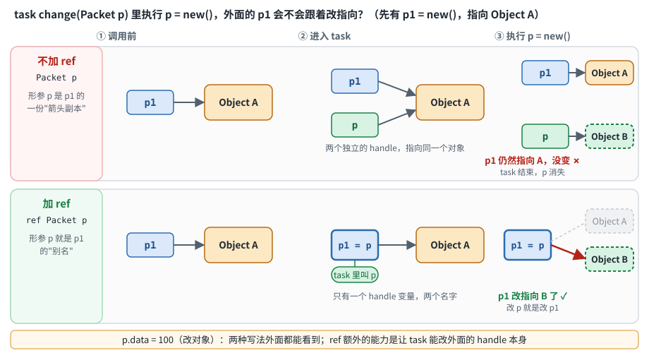

# 句柄作为参数：不加 ref vs 加 ref

先说结论：**`ref` 的特殊之处不是"让我能修改对象"**，class handle 普通传参本来就能修改它指向的同一个对象。`ref` 真正额外提供的能力，是让 task/function 能修改**调用者的 handle 变量本身**，例如让 `p1` 从指向 Object A 改成指向 Object B。

## 1. 先理解：class 变量是 handle，不是对象本身

```systemverilog
Packet p1 = new();   // 可以拆成下面两句
Packet p1;           // 声明一个 handle
p1 = new();          // 创建一个 Packet 对象，让 p1 指向它

p1.data = 20;        // 不是在修改 p1 这个 handle，而是顺着 p1 找到 Object A，再修改 Object A 里的 data
```

把 `p1` 想象成"遥控器"或"箭头"：

```text
p1 ─────────→ Object A
```

- `p1`：handle（句柄）
- `Object A`：真正由 `new()` 创建出来的对象

## 2. 不加 ref：传进去的是 handle 的一份副本

```systemverilog
task change(Packet p);
  p.data = 100;           // 通过形参 p 修改对象
endtask

Packet p1 = new();
change(p1);               // 调用时，p1 里保存的 handle 值被复制一份给形参 p
```

```text
p1 ───────┐
          ▼
       Object A
          ▲
p  ───────┘
```

`p1` 和 `p` 是两个不同的 handle 变量，但指向同一个 Object A。所以 `p.data = 100;` 修改的是 Object A，task 外面看 `p1.data` 也是 `100`。

**即使没有 `ref`，class handle 作为普通参数传递时，仍然可以通过形参修改它指向的对象。**

## 3. 不加 ref 时，为什么 `p = new()` 不会改变 `p1`

```systemverilog
task change(Packet p);
  p = new();              // 创建 Object B，让"局部的 p"指向 B
endtask

Packet p1 = new();        // p1 → Object A
change(p1);               // 调用结束后 p1 仍然 → Object A
```

```text
调用前：   p1 ─────────→ Object A

进入 task：p1 ───────┐
                      ▼
                   Object A
                      ▲
           p  ────────┘

p = new()：p1 ─────────→ Object A       （没变）
           p  ─────────→ Object B       （只有局部的 p 变了）

task 结束： p 消失，p1 ─────────→ Object A
```

原因：`p` 只是 `p1` 的一份 handle 副本。修改 `p` 自己指向哪里，并不会修改 `p1` 指向哪里。

## 4. 加 ref：形参成为外层变量的"别名"

```systemverilog
task change(ref Packet p);
  p = new();              // p 是 p1 的别名，效果上就相当于 p1 = new()
endtask

Packet p1 = new();
change(p1);               // 调用结束后 p1 → Object B
```

`ref Packet p` 最通俗的理解：**不要复制 `p1` 的 handle 给我，而是让我直接操作外面的 `p1` 这个 handle 变量本身。** 进入 task 后，`p` 就是 `p1` 在 task 里面的另一个名字：

```text
进入 task：      p1
                 ↓
              [handle] ─────────→ Object A      外面叫它 p1，里面叫它 p
                 ↑
                 p

p = new() 之后：  p1
                 ↓
              [handle] ─────────→ Object B      p1 从 A 改成指向 B
                 ↑
                 p
```

`p = new()` 做两件事：`new()` 创建一个新的 Object B；把 Object B 的 handle 赋给 `p`。因为 `p` 是 `p1` 的别名，所以这就相当于 `p1 = new()`，`p1` 因此从 Object A 改成了指向 Object B。

## 5. 一张图对比有无 ref



读图方法：两行是同一段代码只差一个 `ref`，三列是时间顺序。

- **不加 ref（上排）**：进入 task 时有**两个**独立的 handle，`p` 是 `p1` 的副本；`p = new()` 只让副本改指向 B，`p1` 仍然指向 A。
- **加 ref（下排）**：进入 task 时只有**一个** handle 变量，里面的名字叫 `p`、外面的名字叫 `p1`；`p = new()` 改的就是它，所以 `p1` 改指向 B。
- 底部那条：`p.data = 100` 这种"改对象"的操作，两排的结果外面都看得到。

## 6. 容易产生误解：不是 `p = p1`

理解 `ref` 时，说"进入 task 后，`p1` 在 task 里面换了一个名字叫 `p`"是对的。但不要写成 `p = p1`：

```systemverilog
p = p1;        // 普通的 handle assignment：复制 handle，p 和 p1 仍然是两个独立的 handle 变量
               //   p1 ──┐
               //        ▼
               //     Object A
               //        ▲
               //   p  ──┘

ref Packet p   // p 直接成为调用者变量 p1 的别名：p ≈ p1 的别名，而不是 p = p1
```

## 7. `p.data = ...` 和 `p = new()` 是完全不同的两件事

这是判断需不需要 `ref` 的关键。

**情况一：修改对象**

```systemverilog
p.data = 100;
p.addr = 20;
p.randomize();
```

```text
p ─────────→ Object A
              ↑
           修改这里
```

修改的是 `p` 指向的对象，通常**不需要 `ref`**：即使普通传参复制了一份 handle，两个 handle 仍然指向同一个对象，对象的修改外层看得到。

**情况二：修改 handle 本身**

```systemverilog
p = new();
p = another_packet;
p = null;
```

这些操作修改的不是 Object A，而是 `p` 这个 handle 自己指向哪里：

```text
原来：        p ─────────→ Object A
执行 p = new() 后：p ─────────→ Object B
```

如果希望这种"指向的改变"同时影响外层的 `p1`，就需要 `ref`。

class 比普通变量多了一层，所以容易绕：

```text
普通 int：  a
            └── 10

class：     p1
             │
             └────────→ Object A
```

使用 class 时一定要分清：① 修改 handle 指向的**对象**；② 修改 **handle 本身**。`p.data = 100;` 属于前者，`p = new();` 属于后者，这两件事不能混在一起。

## 8. 用普通 int 理解 ref

如果 class handle 还是绕，先看普通变量：

```systemverilog
task change(int x);
  x = 100;                // 不加 ref：改的是副本 x
endtask

int a = 10;
change(a);
$display("%0d", a);       // 10：调用时 x = 10 是复制出来的，a 没变
```

```systemverilog
task change(ref int x);
  x = 100;                // 加 ref：x 是 a 的别名，相当于直接 a = 100
endtask

int a = 10;
change(a);
$display("%0d", a);       // 100
```

> Mehta：22.3.1 Pass by Value；22.3.2 Pass by Reference（书里用 `function int mult(ref int a)` 做同样的演示：`a` 在函数里加 5，外面也变了）。

## 9. 判断口诀

看到一个 class 参数 `task xxx(Packet p);`，先问自己：**我是想修改 `p` 指向的对象，还是想修改 `p` 这个 handle 本身？**

| 想做的事 | 例子 | 需要 ref 吗 |
|---|---|---|
| 修改对象 | `p.data = 100;` `p.addr = 20;` `p.randomize();` | 通常不需要 |
| 修改 handle 本身，并希望外层的 handle 也跟着变 | `p = new();` `p = another_packet;` `p = null;` | 需要 |

```text
没有 ref：把 handle 的值复制一份给形参。
有 ref  ：形参直接成为调用者 handle 变量的别名。
```

## 10. 补充：`const ref`

不想让 `ref` 参数在 task/function 里被修改，可以写成 `const ref`，试图修改会编译报错。书里同时提到：可以按引用传递变量、class 属性、unpacked struct 的成员、unpacked 数组的元素，但不能按引用传递 net。

```systemverilog
function int mult(const ref int a);   // const ref：只读引用，不复制（大数组传参更省），也不允许在函数里改
  a = a + 5;                          // 编译错误
  return a * 10;
endfunction
```

> Mehta：22.3.2 Pass by Reference（`const ref` 与可引用的对象类型）。这一节不在你的原笔记里，是我补的。

## 11. 自测要点

1. 不加 `ref`，task 里 `p.data = 100;` 外面的 `p1.data` 会变吗？（会：两个 handle 指向同一个对象）
2. 不加 `ref`，task 里 `p = new();` 外面的 `p1` 会变吗？（不会：`p` 只是副本）
3. 加了 `ref` 之后，`p = new();` 为什么会让 `p1` 改指向？（`p` 是 `p1` 的别名，改 `p` 就是改 `p1`）
4. `ref Packet p` 能不能理解成 `p = p1`？（不能：`p = p1` 是复制 handle，得到两个独立的 handle）
5. 什么时候才需要给 class 参数加 `ref`？（要在 task/function 里改 handle 本身，并且希望外层的 handle 也变）
